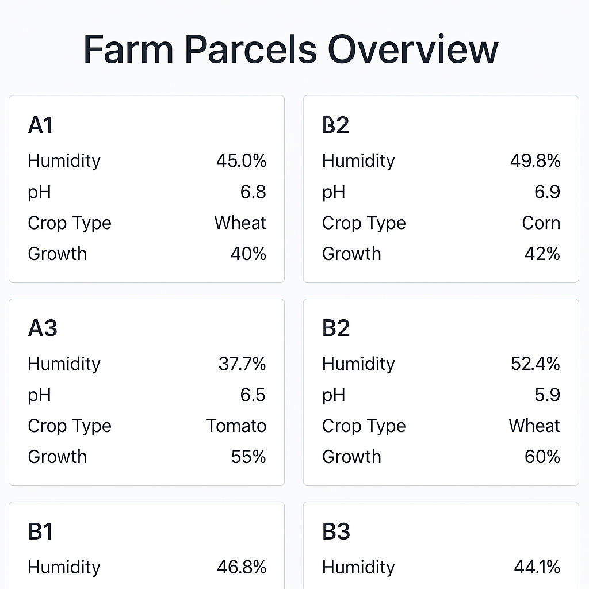

# 🌾 Farm Digital Twin


A digital twin system that simulates a farm divided into squares (A1, A2, B1...) where each square holds its own dynamic data such as soil moisture, temperature, and crop type. This twin provides a real-time representation of a physical farm using MQTT and REST APIs.

---

## 🧠 Concept

Each square on the farm acts as a virtual entity with independent sensor data. This digital twin updates in real time through an MQTT broker and is accessible via an HTTP API for querying and updates.

---

## 🛠️ Tech Stack

- **Python 3**
- **FastAPI** – REST API layer
- **MQTT** – Communication protocol
- **Paho MQTT** – Python MQTT client
- **Uvicorn** – ASGI server
- **.env + dotenv** – Configuration

---

## 🔁 How It Works

1. **MQTT Simulator** sends sensor-like data to topics like `farm/A1/data`
2. **MQTT Listener** receives updates and modifies the twin state
3. **REST API** provides access to the current state of the farm

---

## 📐 Twin State Model

Each square contains:

- `moisture` (percentage)
- `temperature` (°C)
- `crop` (e.g., wheat, corn, empty)

Example:

```json
{
  "A1": {
    "moisture": 47.3,
    "temperature": 22.5,
    "crop": "wheat"
  }
}
```
---

## 🚀 How It Works

1. A **Python script** (`simulate.py`) simulates hourly sensor updates to each farm parcel via the Orion Context Broker.
2. The **FastAPI backend** (`main.py`) acts as a proxy to fetch parcel data from Orion and expose it via `/parcels`.
3. A **frontend dashboard** (`index.html`) displays each parcel's latest humidity, pH, crop type, and growth.
4. Orion Context Broker uses **MongoDB** to persist context data.

---

## 📸 Screenshot


---

## ⚙️ Setup Instructions

### 1. Prerequisites

Make sure you have:
- Python 3.8+
- Orion Context Broker running on `localhost:1026`
    - You can use Docker:
      ```bash
      docker run -d --name orion -p 1026:1026 fiware/orion
      ```

---

### 2. Install Backend Dependencies

```bash
cd fastapi_app
pip install -r requirements.txt
uvicorn main:app --reload --port 8000

